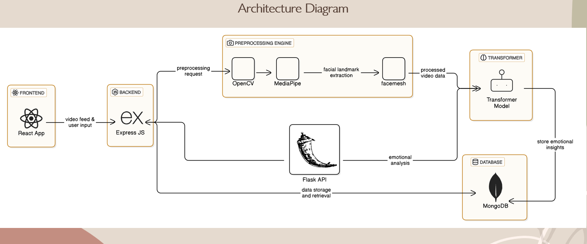
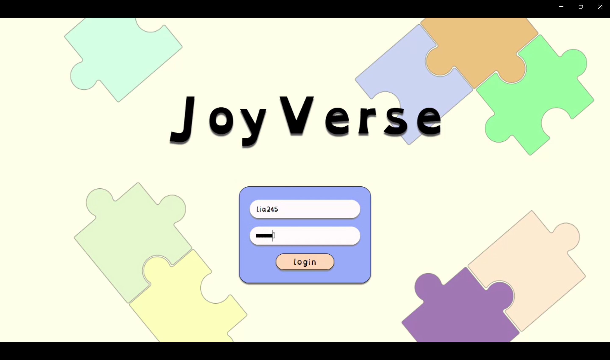
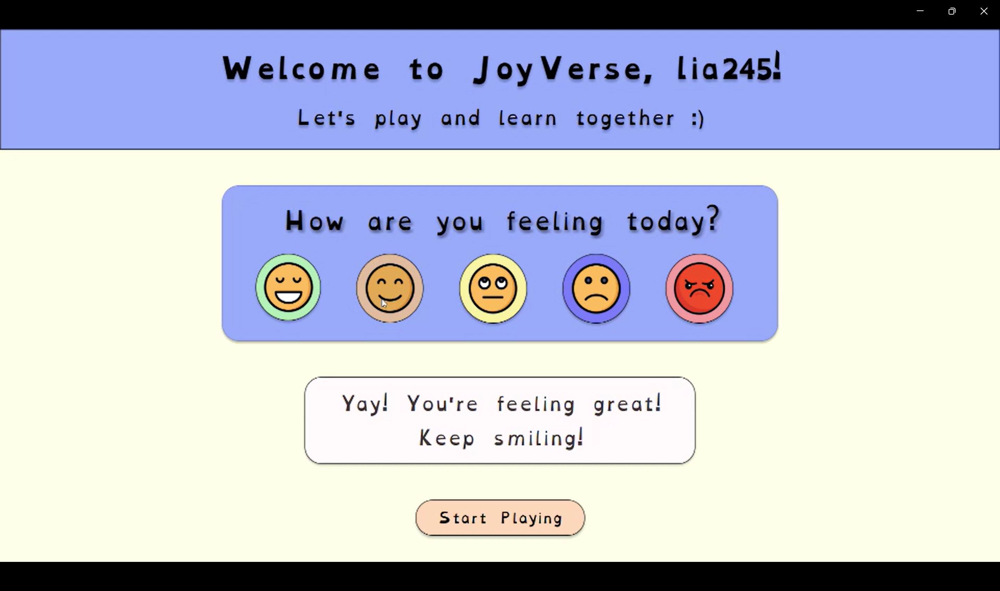
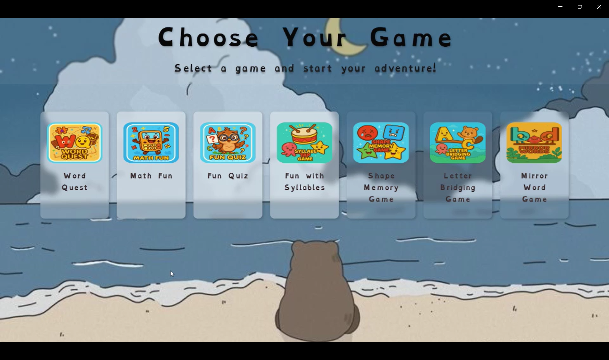
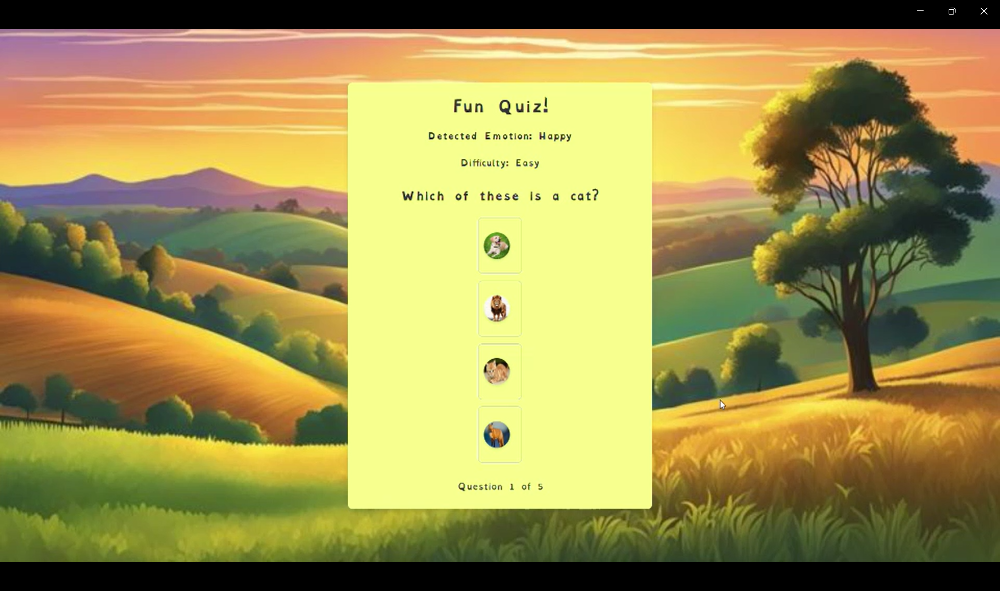
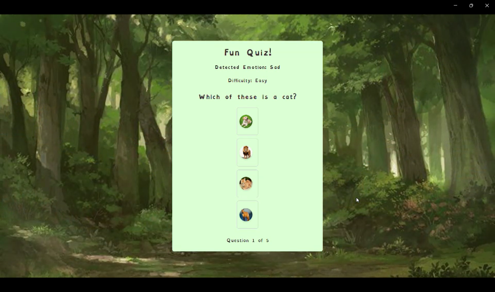
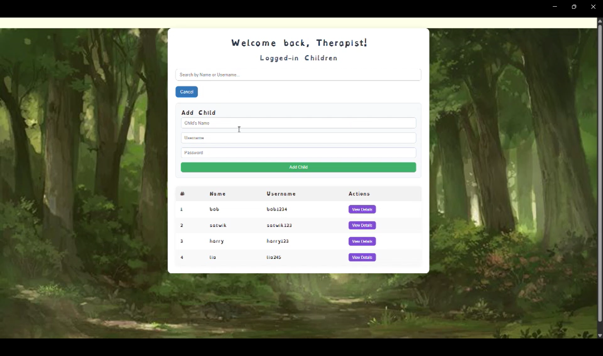
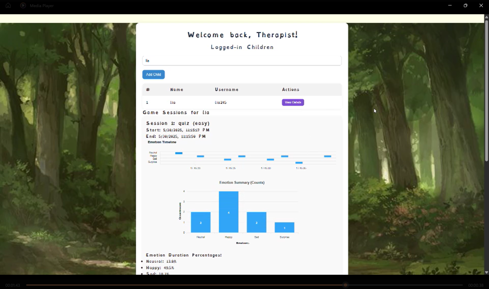
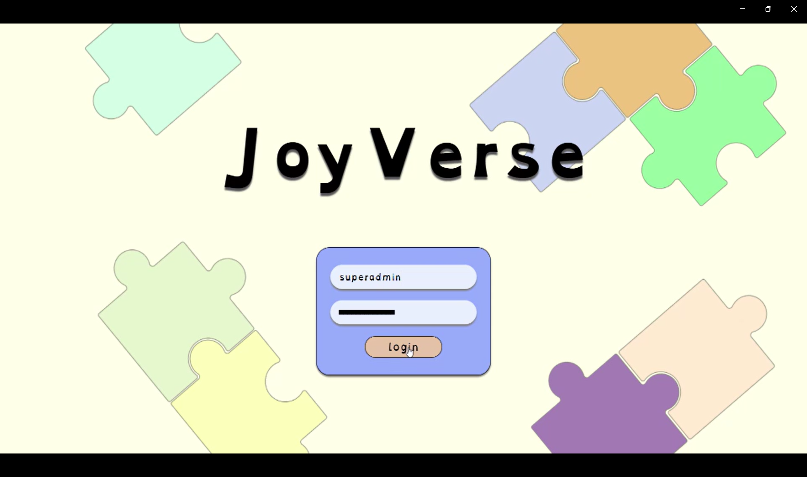
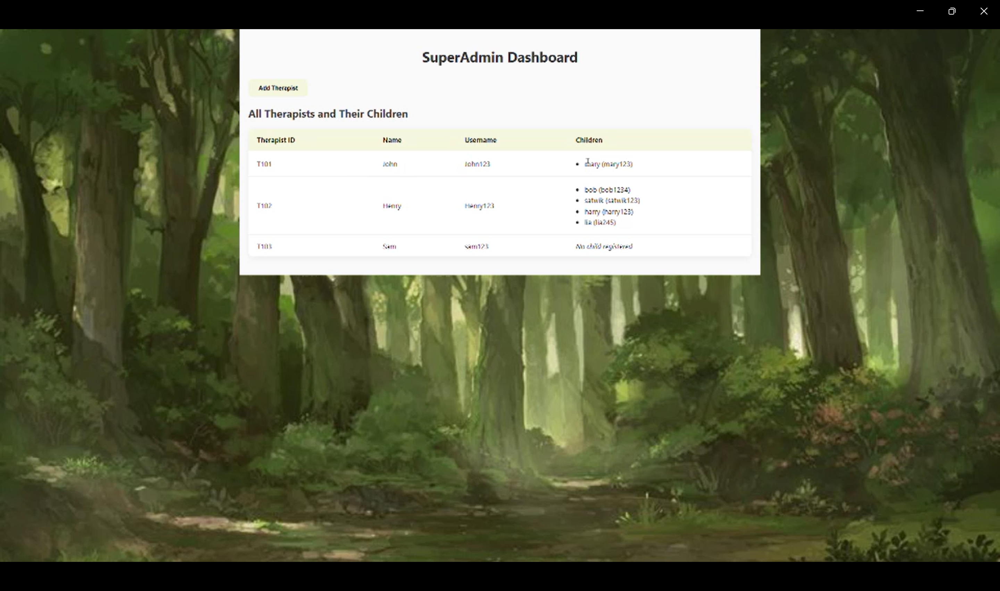

<div align="center">


# 🌈 JoyVerse

### _Where Learning Meets Emotion_

**An intelligent, emotion-adaptive learning platform for children with dyslexia** — powered by real-time facial expression recognition, transformer-based emotion AI, and a therapist analytics dashboard designed to make every learning session smarter and kinder.

<br/>

[](https://reactjs.org/)
[](https://expressjs.com/)
[](https://fastapi.tiangolo.com/)
[](https://www.mongodb.com/atlas)
[](https://pytorch.org/)
[](https://huggingface.co/)
[](https://mediapipe.dev/)
[](LICENSE)

<br/>

> 🏅 **INSPIRE Awardee, Government of India**

<br/>

[Features](#-features) · [Architecture](#-system-architecture) · [Tech Stack](#-tech-stack) · [Getting Started](#-getting-started) · [Mini-Games](#-mini-games) · [Therapist Dashboard](#-therapist-dashboard) · [API Reference](#-api-reference) · [Team](#-team)

</div>

---

## 🧠 What is JoyVerse?

Children with dyslexia face a deeply personal challenge — not just in reading and writing, but in staying motivated when learning feels hard. JoyVerse addresses this with a radical idea: **the app watches how a child feels, and adapts itself accordingly.**

Using a webcam, JoyVerse continuously analyzes the child's facial expressions in real time. When it detects frustration or sadness, it automatically lowers the difficulty and shifts to calming visual themes. When it detects joy or engagement, it celebrates and challenges them further.

The result is a **self-regulating, emotionally intelligent learning environment** — one that never lets a child silently struggle.

On the other side, **therapists and educators get a rich analytics dashboard** showing exactly how a child's emotions correlated with game difficulty, which activities triggered disengagement, and how progress evolves over time — transforming gut feelings into actionable data.

---

## ✨ Features

### For Children

- 🎮 **6 dyslexia-focused mini-games** — word recognition, math, memory, syllables, mirror-words, and quizzes
- 😊 **Emotion-adaptive difficulty** — game challenges auto-adjust based on detected facial expressions
- 🎨 **Adaptive visual themes** — calming or encouraging color schemes activated by emotional state
- 📷 **Non-intrusive monitoring** — real-time webcam-based emotion detection with no interruptions to gameplay
- 🔐 **Secure child profiles** — individual accounts with session history

### For Therapists

- 📊 **Therapist analytics dashboard** — session-by-session emotional insights
- 📈 **Emotion-vs-difficulty correlation charts** — see exactly which difficulty levels triggered emotional changes
- 👶 **Per-child session history** — track progress and emotional trends over time
- 🔍 **Drill-down game analytics** — individual game performance linked to emotional states
- 🔐 **Superadmin controls** — manage children, therapists, and platform-wide settings

---

## 🏗️ System Architecture

```
┌─────────────────────────────────────────────────────────────────────┐
│                          FRONTEND (React)                           │
│   Child Learning UI  ·  Therapist Dashboard  ·  Admin Panel         │
└────────────────────────────┬────────────────────────────────────────┘
                             │  video feed & user input
                             ▼
┌─────────────────────────────────────────────────────────────────────┐
│                      BACKEND (Express.js)                           │
│              REST API · Auth · Session Management                   │
└──────┬──────────────────────────────┬───────────────────┬───────────┘
       │ preprocessing request        │ emotional analysis │ data storage
       ▼                              ▼                    ▼
┌──────────────────┐    ┌─────────────────────┐   ┌───────────────────┐
│ PREPROCESSING    │    │   ML SERVICE        │   │   DATABASE        │
│ ENGINE           │    │   (FastAPI)         │   │   (MongoDB Atlas) │
│                  │    │                     │   │                   │
│  OpenCV          │    │  trpakov/           │   │  Sessions         │
│    ↓             │    │  vit-face-          │   │  Emotions         │
│  MediaPipe       │───▶│  expression         │──▶│  Users            │
│    ↓             │    │  (ViT Transformer)  │   │  Game Results     │
│  FaceMesh        │    │                     │   │                   │
│  (468 landmarks) │    │  POST /predict      │   └───────────────────┘
└──────────────────┘    └─────────────────────┘
```

## 🏗️ Workflow Image

<p align="center">
  
</p>

**Data Flow:**

1. React app captures webcam frames and sends them with user input to Express
2. Express routes the frame to the Preprocessing Engine (OpenCV → MediaPipe → FaceMesh extracts 468 facial landmarks)
3. Processed facial data is passed to the FastAPI ML service
4. The **ViT (Vision Transformer)** model (`trpakov/vit-face-expression`) predicts the emotion
5. Predicted emotion is returned to the frontend to adapt the game state
6. Emotional insights and session data are persisted to MongoDB Atlas

---

## 🛠️ Tech Stack

### Frontend

| Technology                | Purpose                                        |
| ------------------------- | ---------------------------------------------- |
| **React 18**              | Core UI framework                              |
| **React Router**          | Client-side routing across all views           |
| **MediaPipe FaceMesh**    | In-browser 468-point facial landmark detection |
| **TensorFlow.js**         | Client-side ML inference support               |
| **react-webcam**          | Webcam capture component                       |
| **Chart.js + ApexCharts** | Therapist dashboard data visualization         |
| **Axios**                 | HTTP client for API communication              |

### Backend

| Technology                   | Purpose                                        |
| ---------------------------- | ---------------------------------------------- |
| **Node.js + Express**        | REST API server (port 4000)                    |
| **MongoDB Atlas + Mongoose** | Cloud database & ODM                           |
| **bcryptjs**                 | Password hashing for secure auth               |
| **cors + dotenv**            | Cross-origin config and environment management |

### ML Service

| Technology                        | Purpose                                                          |
| --------------------------------- | ---------------------------------------------------------------- |
| **FastAPI**                       | High-performance Python API for ML inference (port 8000)         |
| **HuggingFace Transformers**      | Model loading and inference pipeline                             |
| **`trpakov/vit-face-expression`** | Vision Transformer pre-trained for facial expression recognition |
| **PyTorch**                       | Deep learning backend                                            |
| **OpenCV**                        | Frame preprocessing                                              |
| **MediaPipe**                     | FaceMesh landmark extraction                                     |
| **Pillow (PIL)**                  | Image handling for model input                                   |

---

## 🎮 Mini-Games

All games are designed specifically for children with dyslexia and adapt difficulty + visual theme based on the child's live emotional state.

| Game                  | Description                                           | Dyslexia Focus                     |
| --------------------- | ----------------------------------------------------- | ---------------------------------- |
| **Word Game**         | Identify and select correct words under time pressure | Reading fluency, word recognition  |
| **Math Game**         | Arithmetic challenges with adaptive difficulty        | Numerical processing               |
| **Memory Game**       | Card-flip memory matching sequences                   | Working memory, focus              |
| **Syllables Game**    | Break words into syllables correctly                  | Phonological awareness             |
| **Mirror Words Game** | Identify mirrored/reversed letter patterns            | Visual processing, letter reversal |
| **Quiz Game**         | Multi-topic quiz with progressive difficulty          | Comprehension & recall             |

### Emotion → Game Adaptation Logic

```
Detected Emotion         →   App Response
─────────────────────────────────────────────────
😊 Happy / Engaged       →   Increase difficulty, celebratory animations
😐 Neutral               →   Maintain current difficulty
😢 Sad / Frustrated      →   Lower difficulty, calm color theme, encouragement
😠 Angry                 →   Reduce stimulation, switch to easier task
😲 Surprised             →   Stabilize, check for sudden difficulty spike
```

---

## 📊 Therapist Dashboard

The therapist dashboard provides a data-driven view of each child's learning journey.

**Key Analytics Shown:**

- **Session timeline** — full history of all learning sessions per child
- **Emotion distribution per session** — breakdown of emotions detected (happy, sad, angry, neutral, surprised, etc.)
- **Difficulty level vs. emotional response** — which difficulty tier triggered disengagement or frustration
- **Game-specific performance** — per-game emotion correlation and score trends
- **Progress over time** — longitudinal emotional stability and performance improvement charts

**Dashboard Access Levels:**

- `Therapist` — view and analyze assigned children's sessions
- `Superadmin` — full platform management, user provisioning, all session data

---

## 📁 Repository Structure

```
joy_verse/
├── backend/
│   ├── app.js                  # Express app entry point (port 4000)
│   ├── main.py                 # FastAPI ML service entry point (port 8000)
│   ├── package.json
│   ├── Routes/
│   │   ├── auth.js             # /api/auth — login, register
│   │   ├── children.js         # /api/children — child profiles
│   │   ├── sessions.js         # /api/sessions — session management
│   │   ├── quiz.js             # /api quiz routes
│   │   ├── wordQuestions.js    # /api/wordQuestions
│   │   ├── syllableGame.js     # /api/syllable-game
│   │   ├── mirrorQuestions.js  # /api/mirrorquestions
│   │   ├── superadmin.js       # /api/superadmin
│   │   └── emotion.js          # /api/emotion — emotion log storage
│   └── models/                 # Mongoose schemas
│
├── frontend/
│   └── joyverse/
│       ├── package.json
│       ├── public/
│       └── src/
│           ├── index.js
│           ├── App.js          # Root router
│           ├── pages/          # All screen-level components
│           └── components/     # Reusable UI components
│
└── transformer/
    └── facemesh/
        ├── FacemeshTransformer.ipynb   # Model training & experimentation notebook
        ├── model/                      # Primary trained model artifacts
        ├── model2/                     # Alternate/experimental model
        └── my-facemesh-app/            # Standalone facemesh testing app
```

---

## 🚀 Getting Started

### Prerequisites

Ensure you have the following installed:

- **Node.js** v18+
- **Python** 3.9+
- **pip**
- A **MongoDB Atlas** account and connection string
- A webcam (required for emotion detection)

---

### 1. Clone the Repository

```bash
git clone https://github.com/Preethika005/joy_verse.git
cd joy_verse
```

---

### 2. Environment Setup

Create a `.env` file inside the `backend/` directory:

```env
MONGO_URI=mongodb+srv://<username>:<password>@<cluster>/<dbname>?retryWrites=true&w=majority
MODEL_NAME=trpakov/vit-face-expression
USE_AUTH_TOKEN=false
```

> ⚠️ Never commit your `.env` file. It is already in `.gitignore`.

---

### 3. Start the Backend (Express API)

```bash
cd backend
npm install
npm start
```

The Express API will be available at: **`http://localhost:4000`**

---

### 4. Start the ML Service (FastAPI)

```bash
cd backend
pip install fastapi uvicorn transformers torch pillow opencv-python mediapipe
uvicorn main:app --reload --port 8000
```

The ML inference service will be available at: **`http://localhost:8000`**

> 💡 The first run will download the `trpakov/vit-face-expression` model from HuggingFace (~300MB). Subsequent runs use the cached model.

---

### 5. Start the Frontend (React)

```bash
cd frontend/joyverse
npm install
npm start
```

The app will open at: **`http://localhost:3000`**

---

### All Three Services Running

| Service            | URL                     | Purpose                        |
| ------------------ | ----------------------- | ------------------------------ |
| React Frontend     | `http://localhost:3000` | Child UI + Therapist Dashboard |
| Express Backend    | `http://localhost:4000` | REST API, auth, data           |
| FastAPI ML Service | `http://localhost:8000` | Emotion prediction             |

---

## 📡 API Reference

### Authentication

```
POST   /api/auth/register        # Register a new user
POST   /api/auth/login           # Login and receive JWT
```

### Children

```
GET    /api/children             # List all children (therapist-scoped)
POST   /api/children             # Create a new child profile
GET    /api/children/:id         # Get specific child profile
```

### Sessions

```
GET    /api/sessions             # All sessions
POST   /api/sessions             # Create a new session
GET    /api/sessions/:childId    # Sessions for a specific child
```

### Emotion

```
POST   /api/emotion              # Log an emotion event for a session
GET    /api/emotion/:sessionId   # Get all emotion events for a session
```

### Games

```
GET    /api/wordQuestions        # Fetch word game questions
GET    /api/syllable-game        # Fetch syllable game data
GET    /api/mirrorquestions      # Fetch mirror word questions
GET    /api                      # General quiz route
```

### Superadmin

```
GET    /api/superadmin/users     # All users (admin only)
DELETE /api/superadmin/users/:id # Remove a user
```

### ML Service (FastAPI)

```
POST   /predict                  # Upload image → returns emotion label
```

**Example `/predict` request:**

```bash
curl -X POST http://localhost:8000/predict \
  -F "file=@frame.jpg"
```

**Response:**

```json
{
  "expression": "happy",
  "confidence": 0.94
}
```

---

## 🤖 ML Model Details

**Model:** [`trpakov/vit-face-expression`](https://huggingface.co/trpakov/vit-face-expression)

**Architecture:** Vision Transformer (ViT) fine-tuned on facial expression datasets

**Input pipeline:**

1. Webcam frame captured by React (`react-webcam`)
2. MediaPipe FaceMesh extracts **468 facial landmarks** client-side
3. Processed frame sent to FastAPI `/predict`
4. ViT model classifies into one of **7 emotion classes**:
   - 😊 Happy · 😢 Sad · 😠 Angry · 😐 Neutral · 😲 Surprised · 😨 Fearful · 🤢 Disgusted

**Why ViT for faces?**
Vision Transformers excel at capturing global facial structure through self-attention across image patches — unlike CNNs that process local features. This gives JoyVerse robust, context-aware emotion detection even in variable lighting conditions typical of home and classroom environments.

---

## 🗺️ Roadmap

- [ ] Mobile-responsive UI for tablet use in classrooms
- [ ] Multilingual support (starting with regional Indian languages)
- [ ] Offline mode with cached model inference
- [ ] Parent portal with weekly emotional progress reports
- [ ] Additional games: Spelling, Story comprehension, Pattern recognition
- [ ] Integration with school LMS platforms

---

## 🚀 Working Screens

<p align="center">
  
  
  
  
</p>

<p align="center">
  
  
  
</p>

<p align="center">
  
  
</p>

<p align="center">
  
  
  
</p>

<p align="center">
  
  
  
  
</p>

---

## 📜 License

This project is licensed under the **MIT License** — see [LICENSE](LICENSE) for details.

---

<div align="center">

Made with ❤️ for children who learn differently

**JoyVerse** · KMIT · 2024–2027

</div>
